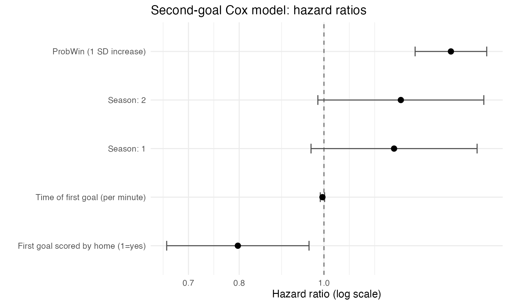
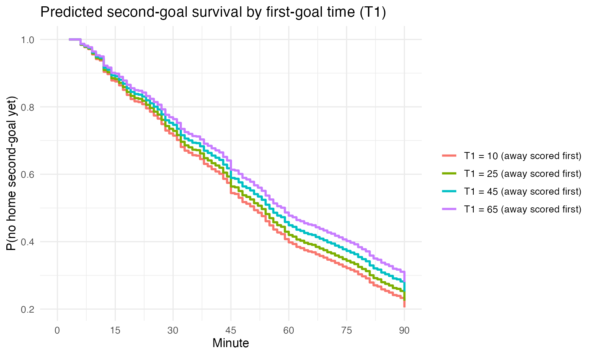
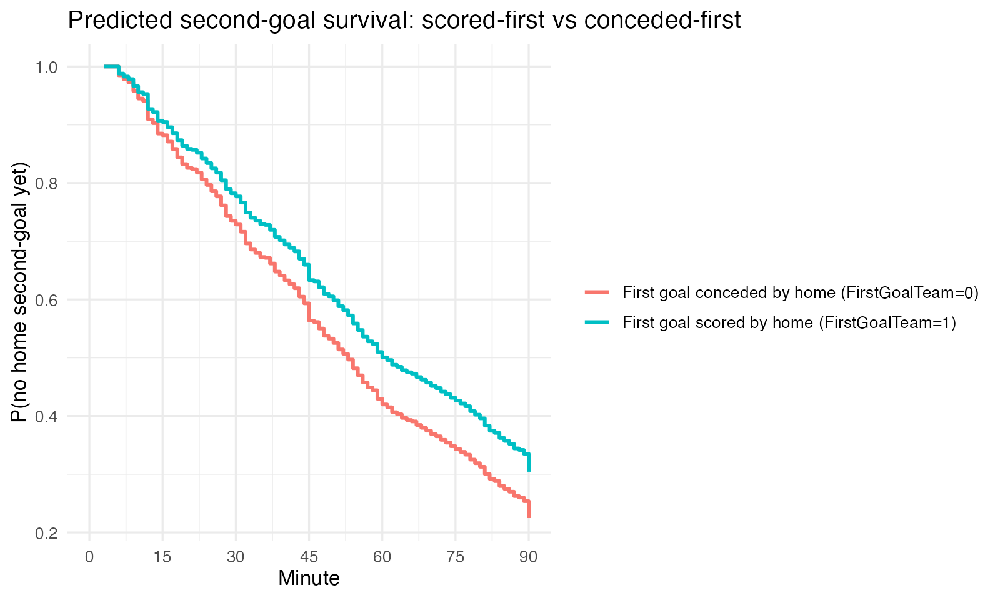
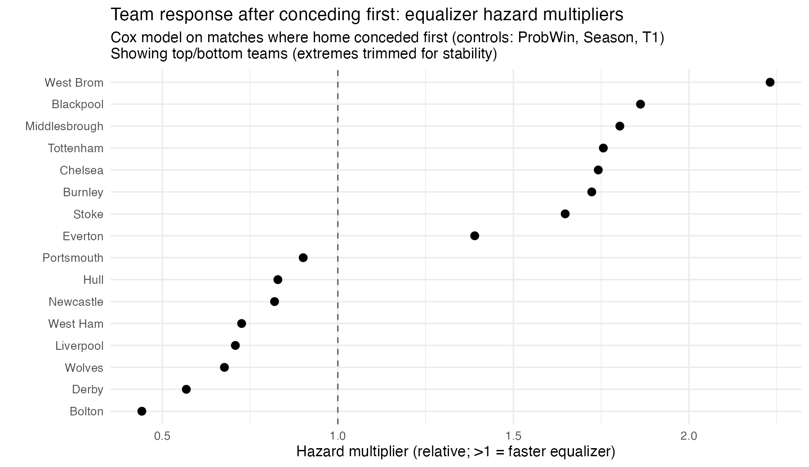

<!-- Markdown slide deck: each `---` is one slide -->

## Slide 1 — Research questions: how does the first goal reshape what happens next?

- This talk follows Nevo & Ritov’s survival-analysis framing: **goal times are events**, and soccer has censoring/truncation issues that survival models handle naturally.
- **RQ1 (timing effect)**: **How does the timing of the first goal influence the time until the second goal?**
  - intuitive contrast: “early opener” vs “late opener” → does the game open up faster or slow down?
- **RQ2 (who scored first)**: **Does it matter which team scores first for subsequent goal timing?**
  - in the paper: scored vs conceded first has similar *first-goal* effect; we test a comparable idea on our data structure.
- **RQ3 (team response)**: **Do some teams respond more effectively after conceding?**
  - operational definition: after conceding first, do some home teams generate **faster equalizers** (higher hazard of scoring next)?
- **Roadmap**
  - hazard/censoring/truncation → dataset setup → model → results for RQ1–RQ3 → extension (team ranking) + limitations

---

## Slide 2 — Background: why survival analysis for goals (and not just Poisson counts)?

- Classic soccer models often focus on **goal counts** (Poisson / bivariate Poisson) and win probabilities.
- But **timing** is a different object:
  - a 2–0 match with goals at 5’ and 20’ is strategically different from goals at 70’ and 88’.
- Survival analysis focuses on:
  - **Survival** \(S(t)=P(T>t)\): probability the event hasn’t happened by time \(t\)
  - **Hazard** \(h(t)\): instantaneous event rate given no event yet
- Nevo & Ritov’s key motivation:
  - first and second goals are **not exchangeable** processes
  - the first goal may *change tactics/risk*, altering the hazard of the next goal

---

## Slide 3 — Hazard, censoring, and truncation in soccer (what the model must handle)

- **Hazard function**:
  \[
  h(t) = \lim_{\Delta\to 0} \frac{P(t \le T < t+\Delta \mid T \ge t)}{\Delta}
  \]
  - “given we’re still waiting at \(t\), how likely is a goal right now?”
- **Right-censoring** (finite match length)
  - if the event (goal of interest) does not occur by 90’, we observe only \(T>90\)
- **Censoring by the other team** (paper’s setup; reflected in our `event`)
  - if modeling “home team goal time,” an away goal can act as censoring
- **Left truncation for second goals**
  - you cannot observe a “second goal clock” until the first goal has occurred
  - survival data for the second goal begins at \(T_1\) (the first-goal time)

---

## Slide 4 — What the rows in our dataset represent (two processes)

- File: `survival_data.csv` has **2,180 rows** and **1,140 matches** (`game_id`)
- We have **two observation types** (`obs_type`)
  - `obs_type = 1`: first-goal observation (pre-first-goal segment; `Goal=0`)
  - `obs_type = 2`: second-goal observation (post-first-goal segment; `Goal=1`)
- Start–stop format
  - each row covers \([tstart, tstop)\) and indicates whether the event occurs at `tstop`
  - this matches Cox model input: `Surv(tstart, tstop, event)`

---

## Slide 5 — Betting covariate: why we use ProbWin (propensity-style summary)

- The paper’s approach: many pre-game factors matter (injuries, form, weather) but are hard to measure.
- Use **`ProbWin`** as a summary of pre-game information:
  - interpreted as market-implied probability that the **home team wins**
  - absorbs many latent pre-game predictors into one scalar covariate
- We also include **`Season`**:
  - controls shifts in scoring environment across seasons (paper notes `ProbWin` may not capture season differences)

---

## Slide 6 — RQ1: how first-goal timing could affect the second-goal hazard

- Let \(T_1\) = time of first goal (in the match), and \(T_2\) = time of the next goal of interest
- Mechanisms that could produce a timing effect:
  - **Early \(T_1\)**: more time remaining → tactical reactions → potentially *more* goals (higher hazard)
  - **Late \(T_1\)**: less time remaining → fewer opportunities → potentially *lower* hazard
  - but also possible reversal: an early goal leads to “shutdown” defense (lower hazard)
- This is exactly why the paper emphasizes: the first goal can **expedite or impede** subsequent scoring depending on timing.

**Best figure to include (paper-style visualization of the timing effect)**

---

## Slide 7 — RQ2: why “who scores first” might matter for the next goal

- Define `FirstGoalTeam`:
  - 1 = home team scored first
  - 0 = away team scored first (home conceded first)
- Why it could matter:
  - **home scored first** → may protect the lead (tempo slows; fewer risky attacks)
  - **home conceded first** → may push for an equalizer (tempo increases; more risk)
- Empirical question: controlling for `ProbWin` and `Season`, is the next-goal hazard different when the home team is leading vs trailing?

---

## Slide 8 — Modeling approach: Cox model for the second-goal process

- We focus on `obs_type = 2` rows: **1,040 matches** where a first goal occurred
- Cox model (second-goal process):
  \[
  h_2(t \mid x)=h_{0,2}(t)\exp(\beta_1 \, ProbWin + \beta_2 \, Season + \beta_3 \, T_1 + \beta_4 \, FirstGoalTeam)
  \]
- What each coefficient means
  - `ProbWin`: baseline strength imbalance
  - `Season`: scoring environment differences
  - `TimeOfFirstGoal` (\(T_1\)): timing effect (RQ1)
  - `FirstGoalTeam`: scored-first vs conceded-first effect (RQ2)
- Note (difference from the paper)
  - the paper also uses time-dependent “time since first goal”; our CSV does not include that covariate, so we focus on the fixed effects above.

---

## Slide 9 — Key results (second-goal Cox): effect sizes for RQ1 and RQ2

- Dataset used: `obs_type = 2`, \(n=1040\), events \(=502\)
- **RQ1 (timing of first goal \(T_1\))**
  - estimated HR per minute: **0.996**
  - 95% CI: **[0.990, 1.002]**
  - p-value: **0.170**
  - interpretation: in this linear specification, the \(T_1\) effect is small and not statistically strong
- **RQ2 (who scored first)**
  - `FirstGoalTeam` HR: **0.797**
  - 95% CI: **[0.661, 0.961]**
  - p-value: **0.0177**
  - interpretation: when the **home team scored first**, the hazard of the home team scoring the next goal is **lower** (consistent with lead-protection vs equalizer urgency)

---

## Slide 10 — PH diagnostics (model validity check)

- Proportional hazards tests (Schoenfeld residuals) for second-goal Cox:
  - global p-value: **0.35**
  - `FirstGoalTeam` p-value: **0.73**
  - `TimeOfFirstGoal` p-value: **0.27**
- Interpretation:
  - we do not see strong evidence that these effects vary over match time
  - supports interpreting the hazard ratios as roughly time-constant multipliers

---

## Slide 11 — Visualizing RQ1: predicted second-goal survival by first-goal time

- The paper’s main idea is that the first goal changes match dynamics depending on timing.
- Predicted survival curves illustrate the *direction* and *magnitude* of differences across \(T_1\) values.
- Here we show predicted curves for \(T_1\in\\{10,25,45,65\\}\) (holding other covariates fixed for illustration).

**Best figure(s) to include**
- paper-provided summary: `fig3_survival_by_T1.pdf`
- our model-based prediction:  

---

## Slide 12 — Visualizing RQ2: predicted second-goal survival for scored-first vs conceded-first

- Fix \(T_1\) (e.g., 25’) and compare `FirstGoalTeam=0` vs `FirstGoalTeam=1`
- Interpretation rule:
  - faster drop in survival ⇒ higher hazard ⇒ quicker home “next goal” time
- This plot directly answers: “does it matter who scored first for subsequent goal timing?”

---

## Slide 13 — RQ3 extension: team-specific “equalizer speed” after conceding first

- Restrict to matches where home conceded first (`FirstGoalTeam = 0`)
  - games: **422**
  - event rate (home equalizes before being scored on again / match ends): **0.479**
- Model idea:
  - fit Cox on this subset with `home_team` effects (controls: `ProbWin`, `Season`, \(T_1\))
  - interpret team coefficients as **equalizer hazard multipliers**
- Outcome interpretation:
  - HR > 1: home team tends to equalize faster after conceding first
  - HR < 1: slower response / less effective equalizer generation

---

## Slide 14 — What to do with baseline hazard figures (and what they add)

- Baseline hazard shows “how goal-likely the match becomes over time,” even after accounting for covariates.
- The paper emphasizes: after a goal occurs, another goal becomes more likely as time progresses.

**Figures that communicate this best**
- Cumulative baseline hazard (Model III):  

- Cumulative baseline hazards + first-vs-second comparison (Model VII):  

---

## Slide 15 — Wrap-up: answers to RQ1–RQ3 (and key limitations)

- **RQ1**: timing of first goal vs second goal timing
  - paper: effect can expedite or impede depending on timing
  - our linear Cox term for \(T_1\) is small / not strongly significant; plots are still useful for interpretation
- **RQ2**: who scored first matters
  - `FirstGoalTeam` shows a statistically meaningful difference in subsequent goal hazard (HR < 1 when home scored first)
- **RQ3**: ranking “response after conceding” is feasible
  - team effects can produce a response ranking, but needs careful regularization/validation
- Limitations (especially for team ranking/generalization)
  - team effects can be unstable with small samples (we observed separation/extreme estimates for some teams)
  - requires shrinkage (random effects / penalization) and out-of-sample checks across seasons/leagues

